群聊集成
=========================

.. highlight:: objective-c

前提条件
----------------------

- 支持 iOS 9.0 或以上版本的 iOS 真机设备

- 有效的菊风开发者账号（`免费注册 <http://developer.juphoon.com/signup>`_ ）

准备工作
----------------------

SDK 下载
>>>>>>>>>>>>>>>>>>>>>>>>>>>>>>>

点击 `iOS SDK <>`_ 进行下载。如果已经下载了 SDK，请直接进行 SDK 配置。

AppKey 获取
>>>>>>>>>>>>>>>>>>>>>>>>>>>>>>>

AppKey 是应用在 菊风云平台 中的唯一标识。需要在 SDK 初始化的时候使用，AppKey 获取请参考 `创建应用 <https://developer.juphoon.com/cn/document/create-application.php>`_ 。

SDK 配置
>>>>>>>>>>>>>>>>>>>>>>>>>>>>>>>

您可以在工程中使用静态库或者动态库，此处介绍使用静态库的配置方法。如果想使用动态库，请参考动态库的配置说明文档 :ref:`iOS 导入动态库<iOS 导入动态库>` 。

.. note::

        如果您已经集成了多家音视频引擎，则推荐使用动态库。

只有完成 SDK 的配置之后，您才可以集成 JC SDK 提供的功能，请按以下操作完成静态库的配置。

**导入静态库**

在 Mac 环境下打开下载的 iOS SDK，在 sdk 文件夹内包含了 lib、framework、include 和 3rd 四个文件夹。

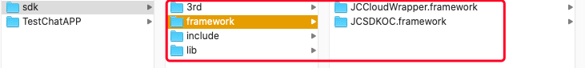

``拷贝文件``

将 sdk 文件夹拷贝到您工程所在的目录下。

``工程设置``

**1. 导入 SDK**

打开 Xcode，进入 TARGETS > Project Name > Build Phases > Link Binary with Libraries 菜单，点击 ‘+’ 符号，导入 sdk framework 文件夹下的 JCSDKOC.framework、JCCloudWrapper.framework 和 lib 文件夹下的两个 .a 文件，如下图：

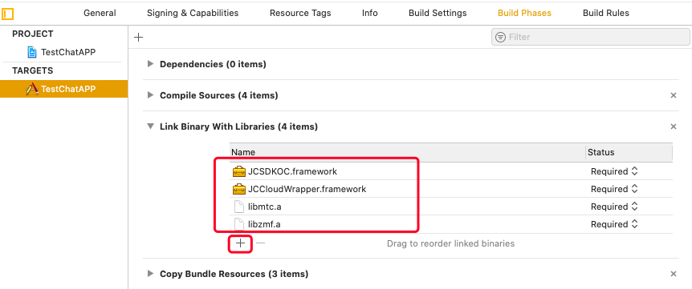

**2. 导入 SDK 依赖的库**

继续点击 ‘+’ 符号，导入下图红框中的库：

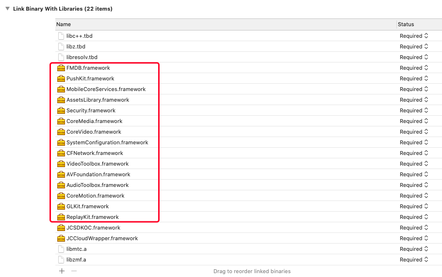

**3. 设置路径**

点击 ‘Build Settings’，找到 Framework Search Paths 、Header Search Paths（头文件路径） 和 Library Search Paths（库文件路径）。并设置 Framework Search Paths、Header Search Paths 和 Library Search Paths，如下图：

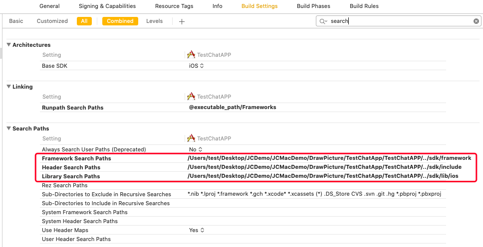

.. note:: 在完成第1步导入 JCSDKOC.framework、JCCloudWrapper.framework 和两个 .a 文件后，Xcode 会自动生成该路径，如果 Xcode 没有自动生成路径，用户要根据 JCSDKOC.framework、JCCloudWrapper.framework 、include 和 lib 库文件所在目录，手动设置路径。

**4. 设置 Enable Bitcode 为 NO**

点击 ‘Build Settings’，找到 Enable Bitcode 设置为 NO，如下图：

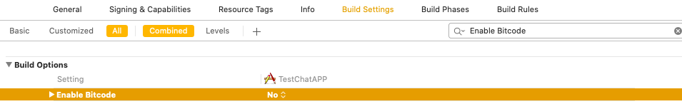

**5. 设置 Other Linker Flags 的参数为 -ObjC**

点击 ‘Build Settings’，找到 Other Linker Flags 并添加参数 -ObjC，如下图：

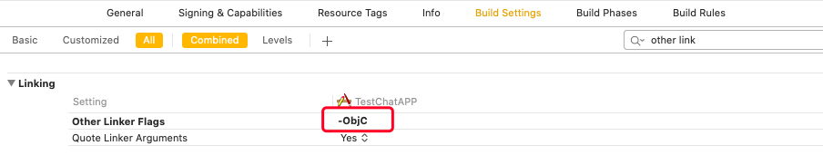

**6.设置预处理宏定义**

点击 ‘Build Settings’，找到 Preprocessor Macros，在右侧输入 ZPLATFORM=ZPLATFORM_IOS，**如果设置了 APNs 推送**，则还需要在 Preprocessor Macros 下的 Debug 中输入 DEBUG，如下图：

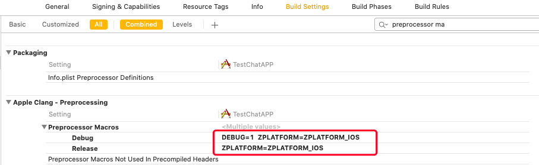

.. note::

    DEBUG 宏定义的目的是为了区分推送环境是 release 还是 debug，环境不对会导致推送失败。

**7. 设置 Documentation Comments 为 NO**

点击 ‘Build Settings’，找到 Documentation Comments 并设置为 NO，如下图：

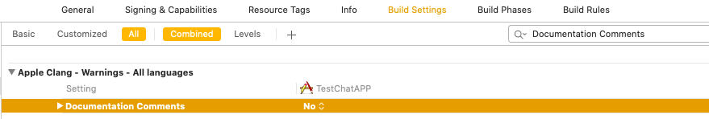

**8. 设置后台运行模式**

点击 ‘Signing & Capabilities’，点击 +Capability 找到 Background Modes，勾选红框内的 Audio, AirPlay, and Picture in Picture ，如下图：

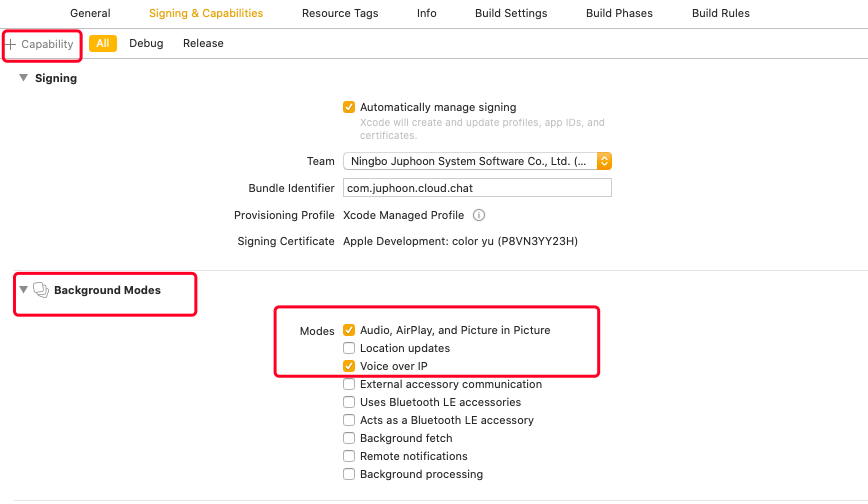

**权限设置**

**9. 设置麦克风和摄像头权限**

点击 ‘Info’，然后添加麦克风和摄像头的权限，如下图：

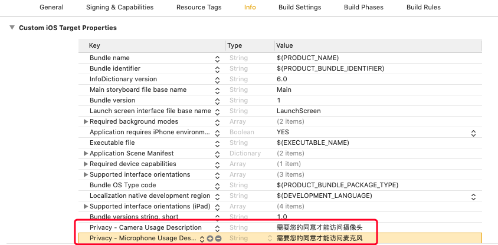

.. list-table::
   :header-rows: 1

   * - Key
     - Type
     - Value
   * - Privacy - Microphone Usage Description
     - String
     - 使用麦克风的目的，如语音通话。
   * - Privacy - Camera Usage Description
     - String
     - 使用摄像头的目的，如视频通话。

**10. 编译运行**

以上步骤进行完后，编译工程，如果提示 succeeded，恭喜您已经成功配置 SDK，可以进行 SDK 初始化了。

.. note:: SDK 不支持模拟器运行，请使用真机。

SDK 初始化
>>>>>>>>>>>>>>>>>>>>>>>>>>>>>>>

引入头文件

使用 SDK 功能前，需要 import 头文件，Swift 项目需要在工程的 Bridging-Header.h 文件中添加 SDK 的引用。
::

    #import <JCCloudWrapper/JCCloudWrapper.h>

开发者在使用 JC SDK 所有功能之前，必须先调用初始化方法初始化 SDK。 在 App 的整个生命周期中，开发者只需要将 SDK 初始化一次。
::

    JCClientCreateParam *param = [[JCClientCreateParam alloc] init];
    param.sdkLogLevel = JCLogLevelInfo;
    param.sdkInfoDir = @"SDK 信息存放路径";
    param.sdkLogDir = @"日志存放路径";
    [JCCloudManager.shared initialize:@"your appkey" createParam:param];

参数介绍：

输入参数

.. list-table::
   :header-rows: 1

   * - 参数
     - 类型
     - 必填
     - 说明
   * - appKey
     - NSString
     - 是
     - 创建应用获取的AppKey，如果还未获取 AppKey，请参考 `创建应用 <https://developer.juphoon.com/cn/document/create-application.php>`_  来获取。
   * - createParam
     - JCClientCreateParam
     - 否
     - 创建参数，通过该参数可以设置 SDK 信息存储目录，日志路径以及日志打印的等级，如果不设置则使用默认值。

返回参数

.. list-table::
   :header-rows: 1

   * - 返回值类型
     - 说明
   * - bool
     - 初始化是否成功

其中，JCClientCreateParam 对象有以下属性
::

    /// sdk信息存储目录
    @property (nonatomic, copy) NSString* __nonnull sdkInfoDir;

    /// sdk日志目录
    @property (nonatomic, copy) NSString* __nonnull sdkLogDir;

    /// sdk日志等级 JCLogLevel
    @property (nonatomic) JCLogLevel sdkLogLevel;

日志等级（JCLogLevel）有四种::

    /// Disable
    JCLogLevelDisable,
    /// Error
    JCLogLevelError,
    /// Info
    JCLogLevelInfo,
    /// Debug
    JCLogLevelDebug

销毁SDK调用反初始化接口
::

    [JCCloudManager.shared uninitialize];

登录
-----------------------

**登录介绍**

登录涉及 JCClient 类及其回调 JCClientCallback，其主要作用是负责登录、登出管理及帐号信息存储。

只有登录成功后才能进行平台上的各种业务。服务器分为鉴权模式和非鉴权模式

 - 鉴权模式: 服务器会检查用户名和密码

 - 免鉴权模式: 只要用户保证用户标识唯一即可, 服务器不校验

.. note::

    目前只支持免鉴权模式，免鉴权模式下当账号不存在时会自动去创建该账号。

在 App 整个生命周期，开发者只需要调用一次登录方法进行登录。之后无论是网络出现异常或者 App 有前后台的切换等，SDK 都会负责自动重连服务器。除非用户主动调用登出接口，或者因为帐号在其他设备登录导致该设备被登出。

登录过程如下：

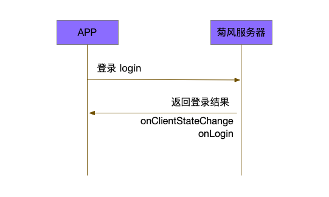

登录设置
>>>>>>>>>>>>>>>>>>>>>>>>>>

登录之前，可以通过 loginParam 登录参数进行登录的相关配置，如服务器地址的设置或者使用代理服务器登录，如不设置则按照默认值登录，具体如下：

::

        JCClientLoginParam* loginParam = [[JCClientLoginParam alloc] init];
        //默认国内环境 http:cn.router.justalkcloud.com:8080
        loginParam.serverAddress = @"服务器地址";
        //如果使用代理服务器登录
        loginParam.httpsProxy = @"代理服务器地址";

其中，服务器地址包括国际环境服务器地址和国内环境服务器地址：

**国际环境** 服务器地址默认为 ``http:intl.router.justalkcloud.com:8080`` 。

**国内环境** 服务器地址默认为 ``http:cn.router.justalkcloud.com:8080`` 。

开发者可以使用 **自定义服务器地址 **。

发起登录
>>>>>>>>>>>>>>>>>>>>>>>>>>

::

        //发起登录
        [JCCloudManager.shared.client login:@"手机号码" password:@"密码" loginParam:loginParam];

参数介绍：

输入参数

.. list-table::
   :header-rows: 1

   * - 参数
     - 类型
     - 必填
     - 说明
   * - userId
     - NSString
     - 是
     - 用户名，为英文数字和'+' '-' '_' '.'，长度不要超过64字符，'-' '_' '.'不能作为第一个字符
   * - password
     - NSString
     - 是
     - 密码，免鉴权模式密码可以随意输入，但不能为空
   * - loginParam 登录参数，nil则按照默认值登录
     - JCClientLoginParam
     - 否
     - 登录参数，nil则按照默认值登录

返回参数

.. list-table::
   :header-rows: 1

   * - 返回类型
     - 说明
   * - bool
     - true 表示正常执行调用流程，false 表示调用异常，异常错误通过 JCClientCallback 通知

其中，JCClientLoginParam 对象有以下属性
::

    /// 服务器地址，默认国内环境 http:cn.router.justalkcloud.com:8080
    @property (nonatomic, copy) NSString* __nonnull serverAddress;

    /// 设备id，一般模拟器使用，因为模拟器可能获得的设备id都一样
    @property (nonatomic, copy) NSString* __nonnull deviceId;

    /// https代理, 例如 192.168.1.100:3128
    @property (nonatomic, copy) NSString* __nullable httpsProxy;

    /// 登录账号不存在的情况下是否内部自动创建该账号，默认为 true
    @property (nonatomic) bool autoCreateAccount;

    /**
     * @brief 终端类型，如果需要多终端登录，则需要为每一类型的设备设置一个类型
     *
     * 例如需要手机端和PC端同时能登录，则手机端设置 moblie，pc端设为 pc，
     * 在调用 login 接口时会把同一类型登录的其他终端踢下线
     * 调用 relogin 接口如果有该类型终端的登录用户则会登录失败
     */
    @property (nonatomic, strong) NSString* __nonnull terminalType;

登录操作发起后，SDK 与菊风服务器的连接状态将发生变化，当 SDK 与菊风服务器的连接状态发生变化时，SDK 会通过 JCClientCallback 回调上报，开发者可通过实现对应的回调方法进行相应的处理。

登录成功之后，首先会触发登录状态改变（onClientStateChange）回调
::

    -(void)onClientStateChange:(JCClientState)state oldState:(JCClientState)oldState
    {
        if (state == JCClientStateIdle) { // 未登录
           ...
        } else if (state == JCClientStateLogining) { // 登录中
           ...
        } else if (state == JCClientStateLogined) {  // 登录成功
           ...
        } else if (state == JCClientStateLogouting) {  // 登出中
           ...
        }
    }

参数介绍：

.. list-table::
   :header-rows: 1

   * - 参数
     - 类型
     - 说明
   * - state
     - JCClientState
     - 当前状态值
   * - oldState
     - JCClientState
     - 之前状态值

其中，JCClientState 有::

    /// 未初始化
    JCClientStateNotInit,
    /// 未登陆
    JCClientStateIdle,
    /// 登陆中
    JCClientStateLogining,
    /// 登陆成功
    JCClientStateLogined,
    /// 登出中
    JCClientStateLogouting,

之后通过 onLogin 回调上报登录结果
::

    -(void)onLogin:(bool)result reason:(JCClientReason)reason {
        if (result) {
            //界面处理
        } else {
            //界面处理
        }
    }

参数介绍：

.. list-table::
   :header-rows: 1

   * - 参数
     - 类型
     - 说明
   * - result
     - bool
     - true 表示登陆成功，false 表示登陆失败
   * - reason
     - JCClientReason
     - 当 result 为 false 时该值有效

其中，JCClientReason 请参考 `API 接口文档 <https://developer.juphoon.com/portal/reference/V2.0/IM/ios/Constants/JCClientState.html>`_。

登录成功之后，SDK 会自动保持与服务器的连接状态，直到用户主动调用登出接口，或者因为帐号在其他设备登录导致该设备被登出。

登出
>>>>>>>>>>>>>>>>>>>>>

登出是指断开与菊风服务器的连接，登出后不能进行平台上的各种业务操作。

登出过程如下：

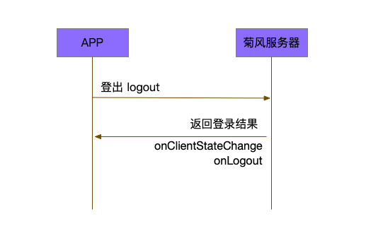

登出发起
::

    [JCCloudManager.shared.client logout];

登出同样会触发登录状态改变（onClientStateChange）回调

之后将通过 onlogout 回调上报登出结果
::

    -(void)onLogout:(JCClientReason)reason {
        NSLog(@"登出原因是%d", reason);
    }

参数介绍：

.. list-table::
   :header-rows: 1

   * - 参数
     - 类型
     - 说明
   * - reason
     - JCClientReason
     - 登出原因

设置昵称
>>>>>>>>>>>>>>>>>>>>>

开发者可以通过 JCClient 类中的 displayName 属性设置昵称
::

    /**
     *  @brief 昵称，用于通话，消息等，可以更直观的表明身份
     */
    @property (nonatomic, copy) NSString* __nonnull displayName;

示例代码::

    client.displayName = @"小张";

登录集成成功之后，即可进行相关业务的集成。

业务集成
----------------------

群聊主要涉及以下几个的类

.. list-table::
   :header-rows: 1

   * - 名称
     - 描述
   * - JCCloudManager
     - 主要用于初始化、管理与cloud相关的所有回调和会话管理
   * - JCCloudDatabase
     - 会话信息的数据库操作（如打开/关闭数据库、获取会话相关的信息、查询、搜索、保存会话信息以及会话的管理等）
   * - JCMessageWrapper
     - 主要用于消息管理，包括发送消息，重发、转发、回复、消息已读、撤回、拉取消息、获取会话列表等
   * - JCGroupWrapper
     - 主要用于群组管理，例如创建群、解散群等操作
   * - JCMessageFetchManager
     - 主要用于会话同步
   * - JCOperationCacheDeal
     - 主要用于返回操作的结果

群组管理
>>>>>>>>>>>>>>>>>>>>>>>>>>>>>>>>>>>>

群组管理包括创建群、删除群、更新群以及查询群功能。

创建群组
++++++++++++++++++++++++++++++

创建群组需要传入群成员对象，首先调用下面的方法构造群成员对象
::

    //构造 JCGroupMember
    JCGroupMember *member = [[JCGroupMember alloc] init:@"群groupId" userId:@"登录cloud平台的账号" uid:@"uid" displayName:@"群昵称" memberType:JCGroupMemberTypeMember changeState:JCGroupChangeStateAdd];

输入参数介绍：

.. list-table::
   :header-rows: 1

   * - 参数
     - 类型
     - 说明
   * - groupId
     - NSString
     - 群组唯一标识
   * - userId
     - NSString
     - 用户标识
   * - uid
     - NSString
     - 服务器端用户标识，当通知成员变化时，changeState 为 JCGroupChangeStateRemove 时只能通过此参数来判断，不能通过 userId
   * - displayName
     - NSString
     - 昵称
   * - memberType
     - JCGroupMemberType
     - 成员类型
   * - changeState
     - JCGroupChangeState
     - 成员变化状态

JCGroupMember 对象的详细信息请参考 API reference。

返回值介绍：

.. list-table::
   :header-rows: 1

   * - 返回值类型
     - 说明
   * - instancetype
     - 返回 JCGroupItem 对象

然后调用下面的方法创建群组
::

    NSArray<JCGroupMember *> *memberList = [NSArray array];
    JCGroupMember *member1 = [[JCGroupMember alloc] init:@"群groupId" userId:@"登录cloud平台的账号" uid:@"uid" displayName:@"群昵称" memberType:JCGroupMemberTypeMember changeState:JCGroupChangeStateAdd];
    JCGroupMember *member2 = [[JCGroupMember alloc] init:@"群groupId" userId:@"登录cloud平台的账号" uid:@"uid" displayName:@"群昵称" memberType:JCGroupMemberTypeMember changeState:JCGroupChangeStateAdd];
    memberList = @[member1, member2];
    [JCGroupWrapper createGroup:memberList groupName:@"群组名称" type:JCGroupTypeNormal customProperties:nil usingBlock:^(bool, int, NSObject * _Nullable) {
        NSLog(@"创建群组");
    }];

输入参数介绍：

.. list-table::
   :header-rows: 1

   * - 参数
     - 类型
     - 说明
   * - members
     - NSArray<JCGroupMember*>
     - 成员列表，uid, memberType 和 displayname 需要赋值
   * - groupName
     - NSString
     - 群名字
   * - type
     - JCGroupType
     - 群类型
   * - customProperties
     - NSDictionary<NSString*, NSObject*>
     - 群自定义属性
   * - block
     - GroupOperationBlock
     - 结果函数

相关回调

创建群会触发 onGroupAdd（新增群）回调
::

    -(void)onGroupAdd:(JCGroupData*)group {
        NSLog(@"新增群");
    }

参数介绍：

.. list-table::
   :header-rows: 1

   * - 参数
     - 类型
     - 说明
   * - group
     - JCGroupData
     - JCGroupData 对象

解散群组
++++++++++++++++++++++++++++++

调用下面的方法解散群组
::

    [JCGroupWrapper dissolve:@"groupServerUid" usingBlock:^(bool, int, NSObject * _Nullable) {
        NSLog(@"解散群组");
    }];

输入参数介绍：

.. list-table::
   :header-rows: 1

   * - 参数
     - 类型
     - 说明
   * - groupServerUid
     - NSString
     - 群 ServerUid
   * - block
     - GroupOperationBlock
     - 结果函数

相关回调

解散群组会触发 onGroupDelete 回调，可以在该回调中进行后续的处理
::

    -(void)onGroupDelete:(JCGroupData*)group {
        NSLog(@"删除群");
    }

参数介绍：

.. list-table::
   :header-rows: 1

   * - 参数
     - 类型
     - 说明
   * - group
     - JCGroupData
     - JCGroupData 对象

更新群组
++++++++++++++++++++++++++++++

更新群组包括增删成员、设置成员的角色、修改群相关属性，如群名称等、上传头像、拉取群消息等。

添加成员
^^^^^^^^^^^^^^^^^^^^^^^^^

调用下面的方法向群组中添加成员
::

    NSArray<JCGroupMember *> *memberList = [NSArray array];
    JCGroupMember *member1 = [[JCGroupMember alloc] init:@"群groupId" userId:@"登录cloud平台的账号" uid:@"uid" displayName:@"群昵称" memberType:JCGroupMemberTypeMember changeState:JCGroupChangeStateAdd];
    JCGroupMember *member2 = [[JCGroupMember alloc] init:@"群groupId" userId:@"登录cloud平台的账号" uid:@"uid" displayName:@"群昵称" memberType:JCGroupMemberTypeMember changeState:JCGroupChangeStateAdd];
    memberList = @[member1, member2];
    [JCGroupWrapper addMembers:@"群 ServerUid" members:memberList usingBlock:^(bool, int, NSObject * _Nullable) {
        NSLog(@"添加群成员");
    }];

输入参数介绍：

.. list-table::
   :header-rows: 1

   * - 参数
     - 类型
     - 说明
   * - groupServerUid
     - NSString
     - 群 ServerUid
   * - members
     - NSArray<JCGroupMember*>
     - 成员列表，uid 和 displayname 需要赋值
   * - block
     - GroupOperationBlock
     - 结果函数

**相关回调**

添加群成员会触发 onGroupMemberAdd 回调
::

    -(void)onGroupMemberAdd:(JCGroupMemberData*)member {
        NSLog(@"添加群成员");
    }

参数介绍：

.. list-table::
   :header-rows: 1

   * - 参数
     - 类型
     - 说明
   * - member
     - JCGroupMemberData
     - JCGroupMemberData 对象

踢掉人员
^^^^^^^^^^^^^^^^^^^^^^^^^

调用下面的方法踢掉群组中的人员
::

    NSArray<NSString*>* uidAry = [NSArray array];
    [uidAry arrayByAddingObject:@"uid1"];
    [JCGroupWrapper kickMembers:@"群 ServerUid" memberServerUids:uidAry usingBlock:^(bool, int, NSObject * _Nullable) {
        NSLog(@"剔除成员");
    }];

输入参数介绍：

.. list-table::
   :header-rows: 1

   * - 参数
     - 类型
     - 说明
   * - groupServerUid
     - NSString
     - 群 ServerUid
   * - memberServerUids
     - NSArray<NSString*>
     - 成员列表
   * - block
     - GroupOperationBlock
     - 结果函数

**相关回调**

删除群成员会触发 onGroupMemberDelete 回调
::

    -(void)onGroupMemberDelete:(JCGroupMemberData*)member {
        NSLog(@"删除群成员");
    }

参数介绍：

.. list-table::
   :header-rows: 1

   * - 参数
     - 类型
     - 说明
   * - member
     - JCGroupMemberData
     - JCGroupMemberData 对象

设置普通成员
^^^^^^^^^^^^^^^^^^^^^^^^^

如果想把某个管理员设置为普通群成员，可以调用下面的方法，**只有当前群主才可以进行此操作**
::

    [JCGroupWrapper modifyToMember:@" 群 ServerUid" memberServerUid:@"成员 serverUid" usingBlock:^(bool, int, NSObject * _Nullable) {
        NSLog(@"设置普通成员");
    }];

输入参数介绍：

.. list-table::
   :header-rows: 1

   * - 参数
     - 类型
     - 说明
   * - groupServerUid
     - NSString
     - 群 ServerUid
   * - memberServerUid
     - NSString
     - 成员 serverUid
   * - block
     - GroupOperationBlock
     - 结果函数

设置管理员
^^^^^^^^^^^^^^^^^^^^^^^^^

如果想把某个成员设置为管理员，可以调用下面的方法，**只有当前群主才可以进行此操作**
::

    [JCGroupWrapper modifyToManager:@" 群 ServerUid" memberServerUid:@"成员 serverUid" usingBlock:^(bool, int, NSObject * _Nullable) {
        NSLog(@"设置管理员");
    }];

输入参数介绍：

.. list-table::
   :header-rows: 1

   * - 参数
     - 类型
     - 说明
   * - groupServerUid
     - NSString
     - 群 ServerUid
   * - memberServerUid
     - NSString
     - 成员 serverUid
   * - block
     - GroupOperationBlock
     - 结果函数

设置群主
^^^^^^^^^^^^^^^^^^^^^^^^^

如果想把某个成员设置为群主，可以调用下面的方法，**只有当前群主才可以进行此操作**
::

    [JCGroupWrapper modifyToOwner:@" 群 ServerUid" memberServerUid:@"成员 serverUid" usingBlock:^(bool, int, NSObject * _Nullable) {
        NSLog(@"设置管理员");
    }];

输入参数介绍：

.. list-table::
   :header-rows: 1

   * - 参数
     - 类型
     - 说明
   * - groupServerUid
     - NSString
     - 群 ServerUid
   * - memberServerUid
     - NSString
     - 成员 serverUid
   * - block
     - GroupOperationBlock
     - 结果函数

**相关回调**

设置群成员角色会触发 onGroupMemberUpdate（群成员更新）回调
::

    -(void)onGroupMemberUpdate:(JCGroupMemberData*)member {
        NSLog(@"群成员更新");
    }

参数介绍：

.. list-table::
   :header-rows: 1

   * - 参数
     - 类型
     - 说明
   * - member
     - JCGroupMemberData
     - JCGroupMemberData 对象

修改自己的群昵称
^^^^^^^^^^^^^^^^^^^^^^^^^

如果想修改自己的群昵称，可以调用下面的方法
::

    [JCGroupWrapper changeDisplayName:@" 群 ServerUid" displayName:@"新的昵称" usingBlock:^(bool, int, NSObject * _Nullable) {
        NSLog(@"修改群昵称");
    }];

输入参数介绍：

.. list-table::
   :header-rows: 1

   * - 参数
     - 类型
     - 说明
   * - groupServerUid
     - NSString
     - 群 ServerUid
   * - displayName
     - NSString
     - 昵称
   * - block
     - GroupOperationBlock
     - 结果函数

设置群自定义属性
^^^^^^^^^^^^^^^^^^^^^^^^^

如果想设置群自定义属性，可以调用下面的方法
::

    NSDictionary<NSString*, NSObject*> *customProperties = [NSDictionary dictionary];
    [customProperties setObject:@"object" forKey:@"key"];
    [JCGroupWrapper setGroupCustomProperties:@" 群 ServerUid" displayName:@"新的昵称" customProperties:customProperties usingBlock:^(bool, int, NSObject * _Nullable) {
        NSLog(@"设置群自定义属性");
    }];

输入参数介绍：

.. list-table::
   :header-rows: 1

   * - 参数
     - 类型
     - 说明
   * - groupServerUid
     - NSString
     - 群 ServerUid
   * - customProperties
     - NSDictionary<NSString*, NSObject*>
     - 群自定义属性集
   * - block
     - GroupOperationBlock
     - 结果函数

群备注更新
^^^^^^^^^^^^^^^^^^^^^^^^^

调用下面的方法更新群备注
::

    NSDictionary<NSString*, NSObject*> *tag = [NSDictionary dictionary];
    [tag setObject:@"object" forKey:@"key"];
    [JCGroupWrapper updateComment:@" 群 ServerUid" nickName:@"群备注名" tag:tag usingBlock:^(bool, int, NSObject * _Nullable) {
        NSLog(@"群备注更新");
    }];

输入参数介绍：

.. list-table::
   :header-rows: 1

   * - 参数
     - 类型
     - 说明
   * - groupServerUid
     - NSString
     - 群 ServerUid
   * - nickName
     - NSString
     - 群备注名
   * - tag
     - NSDictionary<NSString*, NSObject*>
     - 标签，内部会将该 NSDictionary 转为 json
   * - block
     - GroupOperationBlock
     - 结果函数

更改群名称
^^^^^^^^^^^^^^^^^^^^^^^^^

调用下面的方法更改群名称
::

    [JCGroupWrapper changeGroupName:@" 群 ServerUid" groupName:@"群名字" usingBlock:^(bool, int, NSObject * _Nullable) {
        NSLog(@"更改群名称");
    }];

输入参数介绍：

.. list-table::
   :header-rows: 1

   * - 参数
     - 类型
     - 说明
   * - groupServerUid
     - NSString
     - 群 ServerUid
   * - groupName
     - NSString
     - 群名字
   * - block
     - GroupOperationBlock
     - 结果函数

上传群头像
^^^^^^^^^^^^^^^^^^^^^^^^^

调用下面的方法上传群头像，最终是群的 customProperties 会增加 "Icon"（JCGroupIconPropertyKey 在 JCCloudConstants.h 中） 字段，存的是服务器文件链接
::

    [JCGroupWrapper updateGroupIcon:@" 群 ServerUid" path:@"头像文件路径" usingBlock:^(bool, int, NSObject * _Nullable) {
        NSLog(@"上传群头像");
    }];

输入参数介绍：

.. list-table::
   :header-rows: 1

   * - 参数
     - 类型
     - 说明
   * - groupServerUid
     - NSString
     - 群 ServerUid
   * - path
     - NSString
     - 头像文件路径
   * - block
     - GroupOperationBlock
     - 结果函数

更新群信息
^^^^^^^^^^^^^^^^^^^^^^^^^

调用下面的方法更新群信息
::

    [JCGroupWrapper refreshGroupInfo:@" 群 ServerUid" usingBlock:^(bool, int, NSObject * _Nullable) {
        NSLog(@"更新群信息");
    }];

输入参数介绍：

.. list-table::
   :header-rows: 1

   * - 参数
     - 类型
     - 说明
   * - groupServerId
     - NSString
     - 群 serverUid
   * - block
     - GroupOperationBlock
     - 结果函数

拉取服务器更新
^^^^^^^^^^^^^^^^^^^^^^^^^

调用下面的方法拉取服务器更新
::

    [JCGroupWrapper refreshGroups:^(bool, int, NSObject * _Nullable) {
        NSLog(@"拉取服务器更新");
    }];

输入参数介绍：

.. list-table::
   :header-rows: 1

   * - 参数
     - 类型
     - 说明
   * - block
     - GroupOperationBlock
     - 结果函数

离开群组
^^^^^^^^^^^^^^^^^^^^^^^^^

调用下面的方法离开群组，**群主必须转移群主后才能离开**
:

    [JCGroupWrapper leave:@"群 ServerUid" usingBlock:^(bool, int, NSObject * _Nullable) {
        NSLog(@"离开群组");
    }];

输入参数介绍：

.. list-table::
   :header-rows: 1

   * - 参数
     - 类型
     - 说明
   * - groupServerUid
     - NSString
     - 群 ServerUid
   * - block
     - GroupOperationBlock
     - 结果函数

相关回调
^^^^^^^^^^^^^^^^^^^^^^^^^^^^^^

更新群会触发 onGroupUpdate 回调
::

    -(void)onGroupUpdate:(JCGroupData*)group {
        NSLog(@"更新群");
    }

参数介绍：

.. list-table::
   :header-rows: 1

   * - 参数
     - 类型
     - 说明
   * - group
     - JCGroupData
     - JCGroupData 对象

查询群组
++++++++++++++++++++++++++

查询所有群组
^^^^^^^^^^^^^^^^^^^^^^^^^^^

调用下面的方法查询所有群组
::

    NSArray<JCGroupData*>* groupAry = [JCCloudDatabase queryGroups];

其中，JCGroupData 为群组对象，详细信息请参考 API reference。

返回值介绍：

.. list-table::
   :header-rows: 1

   * - 返回值类型
     - 说明
   * - NSArray<JCGroupData*>
     - 群组列表

查询单个群组
^^^^^^^^^^^^^^^^^^^^^^^^^^^

调用下面的方法查询单个群组
::

    JCGroupData * groupData = [JCCloudDatabase queryGroup:@"群服务器 uid"];

输入参数介绍：

.. list-table::
   :header-rows: 1

   * - 参数
     - 类型
     - 说明
   * - serverUid
     - NSString
     - 服务器会话 uid

返回值介绍：

.. list-table::
   :header-rows: 1

   * - 返回值类型
     - 说明
   * - JCGroupData
     - 群组对象

查询群成员列表
^^^^^^^^^^^^^^^^^^^^^^^^^^^

调用下面的方法群成员列表
::

    NSArray<JCGroupMemberData*> * groupMemberData = [JCCloudDatabase queryGroupMembers:@"群服务器 uid"];

输入参数介绍：

.. list-table::
   :header-rows: 1

   * - 参数
     - 类型
     - 说明
   * - serverUid
     - NSString
     - 群服务器 uid

返回值介绍：

.. list-table::
   :header-rows: 1

   * - 返回值类型
     - 说明
   * - NSArray<JCGroupMemberData*>
     - 成员列表

其中，JCGroupMemberData 为群成员信息，详细信息请参考 API reference。

查询单个成员
^^^^^^^^^^^^^^^^^^^^^^^^^^^

调用下面的方法查询单个成员
::

    JCGroupMemberData * groupMemberData = [JCCloudDatabase queryGroupMember:@"群服务器 uid" memberServerUid:@"成员ServerUid"];

输入参数介绍：

.. list-table::
   :header-rows: 1

   * - 参数
     - 类型
     - 说明
   * - serverUid
     - NSString
     - 服务器会话 uid
   * - memberServerUid
     - NSString
     - 成员ServerUid

返回值介绍：

.. list-table::
   :header-rows: 1

   * - 返回值类型
     - 说明
   * - JCGroupMemberData
     - 群成员对象

查询创建的群
^^^^^^^^^^^^^^^^^^^^^^^^^^^

调用下面的方法查询创建的群

::

    NSArray<JCGroupData*> * groupData = [JCCloudDatabase queryOwnedGroups:@"创建者 serverUid"];

输入参数介绍：

.. list-table::
   :header-rows: 1

   * - 参数
     - 类型
     - 说明
   * - memberSeverUid
     - NSString
     - 创建者 serverUid

返回值介绍：

.. list-table::
   :header-rows: 1

   * - 返回值类型
     - 说明
   * - NSArray<JCGroupData*>
     - 群列表

查询加入的群
^^^^^^^^^^^^^^^^^^^^^^^^^^^

调用下面的方法查询加入的群

::

    NSArray<JCGroupData*> * groupData = [JCCloudDatabase queryJoinedGroups:@"创建者 serverUid"];

输入参数介绍：

.. list-table::
   :header-rows: 1

   * - 参数
     - 类型
     - 说明
   * - memberSeverUid
     - NSString
     - 创建者 serverUid

返回值介绍：

.. list-table::
   :header-rows: 1

   * - 返回值类型
     - 说明
   * - NSArray<JCGroupData*>
     - 群列表

搜索包括关键字的群
^^^^^^^^^^^^^^^^^^^^^^^^^^^

调用下面的方法搜索包括关键字的群

::

    //搜索包括关键字的群（群名，群别名，群成员），没有匹配成员则 JCGroupSearchData 的 member 为空
    NSArray<JCGroupSearchData*> * groupSearchData = [JCCloudDatabase searchGroup:@"搜索关键字" includNickName:false];

输入参数介绍：

.. list-table::
   :header-rows: 1

   * - 参数
     - 类型
     - 说明
   * - key
     - NSString
     - 搜索关键字
   * - includNickName
     - bool
     - 是否包含搜索群的 nickName

返回值介绍：

.. list-table::
   :header-rows: 1

   * - 返回值类型
     - 说明
   * - NSArray<JCGroupSearchData*>
     - 群搜索数据列表

其中，JCGroupSearchData 有下面的属性
::

    /// 群
    @property (nonatomic, strong) JCGroupData* group;
    /// 成员列表
    @property (nonatomic, strong) JCGroupMemberData* member;

会话管理
>>>>>>>>>>>>>>>>>>>>>>>>>>>>>>>>>>>>

会话管理主要涉及 JCCloudDatabase 类中的方法，JCCloudDatabase 是数据库管理类，用于会话的增删改查。

数据库操作要在同一线程中，可以通过调用 JCCloudManager 类中的异步调用方法实现数据库的异步操作

异步操作数据库
+++++++++++++++++++++++++++
::

    [JCCloudManager.shared dispatchIm:^{
       //数据库操作
    }];

    [JCCloudManager.shared dispatchImDelay:^{
        //数据库操作
    } delay:1000];

输入参数介绍：

.. list-table::
   :header-rows: 1

   * - 参数
     - 类型
     - 说明
   * - block
     - void(^)(void)
     - block线程
   * - millisecond
     - int
     - 延迟执行时间

打开/关闭数据库
^^^^^^^^^^^^^^^^^^^^^^^^^^^^^

调用下面的方法打开数据库
::

    bool ret = [JCCloudDatabase open:JCCloudManager.shared.client.userId];

输入参数介绍：

.. list-table::
   :header-rows: 1

   * - 参数
     - 类型
     - 说明
   * - name
     - NSString
     - 用户userId

返回值介绍：

.. list-table::
   :header-rows: 1

   * - 返回值类型
     - 说明
   * - bool
     - 方法是否调用成功

调用下面的方法关闭数据库
::

    [JCCloudDatabase close];

创建会话
+++++++++++++++++++++++++++

发起群聊，首先会根据传入的 serverUid 查询本地数据库有无此会话，没有则会自动创建
::

    long conversationId = [JCCloudDatabase getConversation:@"服务器会话 uid"];

输入参数介绍：

.. list-table::
   :header-rows: 1

   * - 参数
     - 类型
     - 说明
   * - serverUid
     - NSString
     - 服务器会话 uid，一对一实际是对方的个人 uid，群组 id 要创建成功才能获得

返回值介绍：

.. list-table::
   :header-rows: 1

   * - 返回值类型
     - 说明
   * - long
     - 会话id，没有返回 -1

创建会话有两种方式：

- 以当前时间创建

::

    long conversationId = [JCCloudDatabase getOrCreateConversation:JCConversationTypeGroup serverUid:@"服务器会话 uid" name:@"会话名字"];

输入参数介绍：

.. list-table::
   :header-rows: 1

   * - 参数
     - 类型
     - 说明
   * - type
     - JCConversationType
     - 会话类型，一对一和群聊
   * - serverUid
     - NSString
     - 服务器会话 uid，一对一实际是对方的个人 uid，群组 id 要创建成功才能获得
   * - name
     - NSString
     - 会话名字，只针对一对一会话有效

其中，JCConversationType 有下面两种::

    /// 一对一
    JCConversationType1To1 = JCMessageChannelType1To1,
    /// 群组
    JCConversationTypeGroup = JCMessageChannelTypeGroup,

返回值介绍：

.. list-table::
   :header-rows: 1

   * - 返回值类型
     - 说明
   * - long
     - 会话id，没有返回 -1

- 通过自定义活跃时间创建，会话排序会根据传入的 activeTime 排列，开发者可根据需求是否需传入会话排序。

::

    long conversationId = [JCCloudDatabase getOrCreateConversation:JCConversationTypeGroup serverUid:@"服务器会话 uid" name:@"会话名字" lastActiveTime:lastActiveTime];

输入参数介绍：

.. list-table::
   :header-rows: 1

   * - 参数
     - 类型
     - 说明
   * - type
     - JCConversationType
     - 会话类型，一对一和群聊
   * - serverUid
     - NSString
     - 服务器会话 uid，一对一实际是对方的个人 uid，群组 id 要创建成功才能获得
   * - name
     - NSString
     - 会话名字，只针对一对一会话有效
   * - lastActiveTime
     - long
     - 最后活跃时间,  <=0 则按当前时间

返回值介绍：

.. list-table::
   :header-rows: 1

   * - 返回值类型
     - 说明
   * - long
     - 会话id，没有返回 -1

**相关回调**

创建会话会收到 onConversationAdd（新增会话） 回调
::
    
    -(void)onConversationAdd:(long)conversationId {
        NSLog(@"收到新增会话回调，conversationId %ld", conversationId);
    }

参数介绍：

.. list-table::
   :header-rows: 1

   * - 参数
     - 类型
     - 说明
   * - conversationId
     - long
     - 会话数据库 id

删除会话
+++++++++++++++++++++++++++

删除单个会话
^^^^^^^^^^^^^^^^^^^^^^^^^^^^^

通过传入本地会话 id 删除会话
::

    [JCCloudDatabase deleteConversation:@"本地会话 id"];

输入参数介绍：

.. list-table::
   :header-rows: 1

   * - 参数
     - 类型
     - 说明
   * - conversationId
     - long
     - 会话数据库 id

删除所有会话
^^^^^^^^^^^^^^^^^^^^^^^^^^^^^

::

    [JCCloudDatabase deleteAllConversations];

相关回调
^^^^^^^^^^^^^^^^^^^^^^^^^^^^^

删除会话会触发 onConversationDelete 回调

::
    
    -(void)onConversationDelete:(long)conversationId {
        NSLog(@"删除会话回调，conversationId %ld", conversationId);
    }

参数介绍：

.. list-table::
   :header-rows: 1

   * - 参数
     - 类型
     - 说明
   * - conversationId
     - long
     - 会话数据库 id

更新会话
+++++++++++++++++++++++++++

更新会话信息
^^^^^^^^^^^^^^^^^^^^^^^^^^^^^

::

    [JCCloudDatabase updateConversation:@"旧的JCConversationData对象"];

输入参数介绍：

.. list-table::
   :header-rows: 1

   * - 参数
     - 类型
     - 说明
   * - oldConversationData
     - JCConversationData
     - 旧的会话

更新会话名字
^^^^^^^^^^^^^^^^^^^^^^^^^^^^^

::

    [JCCloudDatabase updateConversationNameIfNeed:@"会话服务器id" name:@"会话名称"];

输入参数介绍：

.. list-table::
   :header-rows: 1

   * - 参数
     - 类型
     - 说明
   * - serverUid
     - NSString
     - 会话服务器id
   * - serverUid
     - NSString
     - 服务器会话 uid，一对一实际是对方的个人 uid，群组 id 要创建成功才能获得
   * - name
     - NSString
     - 会话名字，只针对一对一会话有效

更新会话图标
^^^^^^^^^^^^^^^^^^^^^^^^^^^^^

::

    [JCCloudDatabase updateConversationIconIfNeed:@"服务器会话 uid" icon:@"会话图标"];

输入参数介绍：

.. list-table::
   :header-rows: 1

   * - 参数
     - 类型
     - 说明
   * - serverUid
     - NSString
     - 服务器会话 uid
   * - icon
     - NSString
     - 会话图标

保存草稿
^^^^^^^^^^^^^^^^^^^^^^^^^^^^^

::

    [JCCloudDatabase saveDraft:conversationId content:@"文本内容" contentType:@"text" filePath:@"文件路径"];

输入参数介绍：

.. list-table::
   :header-rows: 1

   * - 参数
     - 类型
     - 说明
   * - conversationId
     - long
     - 会话数据库id
   * - content
     - NSString
     - 文本内容
   * - contentType
     - NSString
     - 类型
   * - filePath
     - NSString
     - 文件路径

清除草稿
^^^^^^^^^^^^^^^^^^^^^^^^^^^^^

::

     [JCCloudDatabase clearDraft:conversationId];

输入参数介绍：

.. list-table::
   :header-rows: 1

   * - 参数
     - 类型
     - 说明
   * - conversationId
     - long
     - 会话数据库id

设置会话所有消息本地已读
^^^^^^^^^^^^^^^^^^^^^^^^^^^^^

在会话界面中调用下面的方法将会话所有消息标为本地已读
::

    [JCCloudDatabase markConversationRead:conversationId];

输入参数介绍：

.. list-table::
   :header-rows: 1

   * - 参数
     - 类型
     - 说明
   * - conversationId
     - long
     - 本地会话 id

参数介绍：

.. list-table::
   :header-rows: 1

   * - 参数
     - 类型
     - 说明
   * - conversationId
     - long
     - 会话数据库 id

设置会话置顶
^^^^^^^^^^^^^^^^^^^^^^^^^^^^^

在会话界面中调用 JCCloudManager 类中的 setConversationPriority 方法设置会话置顶
::

    [JCCloudManager.shared setConversationPriority:conversationId isPriority:true usingBlock:^(bool, int, NSObject * _Nullable) {
        NSLog(@"设置优先级")
    }

输入参数介绍：

.. list-table::
   :header-rows: 1

   * - 参数
     - 类型
     - 说明
   * - conversationId
     - long
     - 本地会话 id
   * - isPriority
     - bool
     - 是否置顶
   * - block
     - CloudOperationBlock
     - 结果函数

参数介绍：

.. list-table::
   :header-rows: 1

   * - 参数
     - 类型
     - 说明
   * - conversationId
     - long
     - 会话数据库 id

会话免打扰
^^^^^^^^^^^^^^^^^^^^^^^^^^^^^

在会话界面中调用 JCCloudManager 类中的 setConversationDnd 方法设置会话免打扰
::

    [JCCloudManager.shared setConversationDnd:conversationId dnd:true usingBlock:^(bool, int, NSObject * _Nullable) {
        NSLog(@"设置会话免打扰")
    }

输入参数介绍：

.. list-table::
   :header-rows: 1

   * - 参数
     - 类型
     - 说明
   * - conversationId
     - long
     - 会话 id
   * - dnd
     - bool
     - 是否免打扰
   * - block
     - CloudOperationBlock
     - 结果函数

相关回调
^^^^^^^^^^^^^^^^^^^^^^^^^^^^^

更新会话会触发 onConversationUpdate（会话更新）的回调

::

    -(void)onConversationUpdate:(long)conversationId {
        NSLog(@"会话:%ld 更新", conversationId);
    }

参数介绍：

.. list-table::
   :header-rows: 1

   * - 参数
     - 类型
     - 说明
   * - conversationId
     - long
     - 会话数据库 id

查询会话
+++++++++++++++++++++++++++

查询所有会话
^^^^^^^^^^^^^^^^^^^^^^^^^^^^^

登录成功之后，开发者可以调用下面接口获取 SDK 在本地数据库生成的会话列表，获取到的会话列表按照时间倒序排列，置顶会话会排在最前。
::

    NSArray<JCConversationData*>* conversationsData = [JCCloudDatabase queryConversations];

返回值介绍：

.. list-table::
   :header-rows: 1

   * - 返回值类型
     - 说明
   * - JCConversationData 对象数组
     - 返回数据库中所有的会话

JCConversationData 对象原型请参考 API reference 中的 JCCloudDatabase 类。

查询单个会话
^^^^^^^^^^^^^^^^^^^^^^^^^^^^^

查询单个会话有两种方式，开发者可以根据需求选择调用

- 通过会话 id 查询单个会话

::

    JCConversationData* data = [JCCloudDatabase queryConversation:@"会话id"];

输入参数介绍：

.. list-table::
   :header-rows: 1

   * - 参数
     - 类型
     - 说明
   * - conversationId
     - long
     - 会话id

返回值介绍：

.. list-table::
   :header-rows: 1

   * - 返回值类型
     - 说明
   * - JCConversationData
     - 会话对象

- 通过 ServerUid 查询会话

::

    JCConversationData* data = [JCCloudDatabase queryConversationByServerUid:@"服务器会话 uid"];

输入参数介绍：

.. list-table::
   :header-rows: 1

   * - 参数
     - 类型
     - 说明
   * - serverUid
     - NSString
     - 服务器会话 uid

返回值介绍：

.. list-table::
   :header-rows: 1

   * - 返回值类型
     - 说明
   * - JCConversationData
     - 会话对象

获得本地会话 id
^^^^^^^^^^^^^^^^^^^^^^^^^^^^^

- 根据 serverUid 获得本地会话 id

::

    long conversationId = [JCCloudDatabase getConversation:@"serverUid"];

输入参数介绍：

.. list-table::
   :header-rows: 1

   * - 参数
     - 类型
     - 说明
   * - serverUid
     - NSString
     - 服务器会话 uid，一对一实际是对方的个人 uid，群组 id 要创建成功才能获得

返回值介绍：

.. list-table::
   :header-rows: 1

   * - 返回值类型
     - 说明
   * - long
     - 会话id，没有返回 -1

- 根据消息服务器 id 获得本地会话 id

::

    long conversationId = [JCCloudDatabase getConversationByServerMessageId:serverMessageId];

输入参数介绍：

.. list-table::
   :header-rows: 1

   * - 参数
     - 类型
     - 说明
   * - serverMessageId
     - long
     - 消息服务器 id

返回值介绍：

.. list-table::
   :header-rows: 1

   * - 返回值类型
     - 说明
   * - long
     - 本地会话 id

获得所有的未读消息数
^^^^^^^^^^^^^^^^^^^^^^^^^^^^^

::

    [JCCloudDatabase getToltalUnreadMessageCount:false];

输入参数介绍：

.. list-table::
   :header-rows: 1

   * - 参数
     - 类型
     - 说明
   * - includeDndConversation
     - bool
     - 是否包含免打扰会话

返回值介绍：

.. list-table::
   :header-rows: 1

   * - 返回值类型
     - 说明
   * - long
     - 所有的未读消息数

消息管理
>>>>>>>>>>>>>>>>>>>>>>>>>>>>>>>>>>>>

消息介绍
+++++++++++++++++++++++++++

SDK 中用于表示消息的对象为 JCConversationMessageData。它是 IM 即时通讯中最关键最重要的类，是传递信息的基本模型。

JCConversationMessageData 对象包含消息id、会话id、发送消息的userId等属性，详见 API reference 中的  JCCloudDatabase 类。

消息支持的类型有：文字、文件、图片、表情、位置、语音消息、小视频。

发送/转发/回复消息
+++++++++++++++++++++++++++

发送文本消息
^^^^^^^^^^^^^^^^^^^^^^^^^^^^^

文本消息包括文字、Emoji、地理位置消息以及 @ 消息，上层可通过 contentType 参数定义消息类型
::

    [JCMessageWrapper sendText:JCMessageChannelType1To1 serverUid:@"会话服务器 id" contentType:@"Text" content:@"文本内容" extraParams:nil atAll:false atServerUidList:nil];

输入参数介绍：

.. list-table::
   :header-rows: 1

   * - 参数
     - 类型
     - 说明
   * - type
     - JCMessageChannelType
     - 消息所属会话类型
   * - serverUid
     - NSString
     - 话服务器 id，一对一必须先获得对方 userId 的 serverUid，群聊必须先获得群的 serverUid
   * - contentType
     - NSString
     - 消息类型
   * - content
     - NSString
     - 消息内容
   * - extra
     - NSDictionary<NSString*, NSObject*>
     - 额外信息
   * - atAll
     - bool
     - 是否@全体成员，针对群消息
   * - atServerUidList
     - NSArray<NSString*>
     - @成员的serverUid列表 针对群消息

其中，JCMessageChannelType（消息类型）有::

    /// 一对一消息
    JCMessageChannelType1To1,
    /// 群组消息
    JCMessageChannelTypeGroup,

发送文件消息
^^^^^^^^^^^^^^^^^^^^^^^^^^^^^

文件消息包括文件、图片、视频、语音消息。均通过 sendFile 方法发送，并通过 contentType 参数进行不同消息类型的标识。具体如下

::

    //发送图片
    [JCMessageWrapper sendFile:JCMessageChannelType1To1 serverUid:@"会话服务器 id" contentType:@"Image" filePath:@"文件路径" thumbPath:@"缩略图路径" size:size duration:0 extraParams:@{"width":"oringinImage.size.width","height":"oringinImage.size.height"} expiredSeconds:expiredSeconds atAll:true atServerUidList:nil];

    //发送视频
    [JCMessageWrapper sendFile:JCMessageChannelType1To1 serverUid:@"会话服务器 id" contentType:@"Video" filePath:@"文件路径" thumbPath:@"缩略图路径" size:size duration:seconds extraParams:@{"width":"thumbImage.size.width","height":"thumbImage.size.height"} expiredSeconds:expiredSeconds atAll:true atServerUidList:nil];

    //发送音频
    [JCMessageWrapper sendFile:JCMessageChannelType1To1 serverUid:@"会话服务器 id" contentType:@"Audio" filePath:@"文件路径" thumbPath:nil size:size duration:seconds extraParams:nil expiredSeconds:expiredSeconds atAll:true atServerUidList:nil];

输入参数介绍：

.. list-table::
   :header-rows: 1

   * - 参数
     - 类型
     - 说明
   * - type
     - JCMessageChannelType
     - 消息所属会话类型
   * - serverUid
     - NSString
     - 话服务器 id，一对一必须先获得对方 userId 的 serverUid，群聊必须先获得群的 serverUid
   * - contentType
     - NSString
     - 消息类型
   * - filePath
     - NSString
     - 文件本地路径
   * - thumbPath
     - NSString
     - 缩略图本地路径
   * - size
     - int
     - 文件大小
   * - duration
     - int
     - 文件时长
   * - extraParams
     - NSDictionary<NSString*, NSObject*>
     - 额外信息
   * - expiredSeconds
     - int
     - 过期秒数，-1表示永久
   * - atAll
     - bool
     - 是否@全体成员，针对群消息
   * - atServerUidList
     - NSArray<NSString*>
     - @成员的serverUid列表 针对群消息

发送文件接口调用后会触发 onPreDealFileTransfer 回调，该回调返回 true 表示上层要要对该文件进行处理，处理完需要调用 JCMessageWrapper 类中的 setPreDealFile 方法设置处理后的文件，返回 false 则表示内部继续处理
::

    // 预处理文件发送
    -(bool)onPreDealFileTransfer:(JCConversationMessageData* __nonnull)message;

参数介绍：

.. list-table::
   :header-rows: 1

   * - 参数
     - 类型
     - 说明
   * - message
     - JCConversationMessageData
     - 消息对象

返回值介绍：

.. list-table::
   :header-rows: 1

   * - 返回值类型
     - 说明
   * - bool
     - true 表示上层要要对该文件进行处理，处理完需要调用 JCMessageWrapper.setPreDealFile，false 则内部继续处理

设置处理完的文件
::

    [JCMessageWrapper setPreDealFile:messageId result:true  dealedFilePath:@"处理后的文件路径" dealedFileSize:size];

输入参数介绍：

.. list-table::
   :header-rows: 1

   * - 参数
     - 类型
     - 说明
   * - messageId
     - long
     - 数据库消息 id
   * - result
     - bool
     - 处理结果
   * - dealedFilePath
     - NSString
     - 处理后的文件路径
   * - dealedFileSize
     - int
     - 处理后的文件大小

消息重发
^^^^^^^^^^^^^^^^^^^^^^^^^^^^^

调用下面的方法进行消息重发，只针对发送失败消息的情况，会删除原先消息并重新生成一条
::

    // 重发消息，只针对发送失败消息，会删除原先消息并重新生成一条
    [JCMessageWrapper resendMessage:messageId];

输入参数介绍：

.. list-table::
   :header-rows: 1

   * - 参数
     - 类型
     - 说明
   * - messageId
     - long
     - 数据库消息 id

消息转发
^^^^^^^^^^^^^^^^^^^^^^^^^^^^^

消息转发分为单条转发和合并转发。

- 单条转发

::

    //转发消息，有文件url和文本消息都可以转发
    [JCMessageWrapper forwordMessage:messageIds serverUids:serverUids];

输入参数介绍：

.. list-table::
   :header-rows: 1

   * - 参数
     - 类型
     - 说明
   * - messageIds
     - NSArray<NSNumber*>
     - 数据库消息 id 列表
   * - serverUids
     - NSArray
     - 会话 serverUid 列表

- 合并转发

::

    //合并转发消息，有文件url和文本消息都可以转发
    [JCMessageWrapper mergeForwordMessage:messageIds serverUids:serverUids title:@"标题"];

输入参数介绍：

.. list-table::
   :header-rows: 1

   * - 参数
     - 类型
     - 说明
   * - messageIds
     - NSArray<NSNumber*>
     - 数据库消息 id 列表
   * - serverUids
     - NSArray
     - 会话 serverUid 列表
   * - title
     - NSString
     - 标题

消息回复
^^^^^^^^^^^^^^^^^^^^^^^^^^^^^

::

    [JCMessageWrapper replyMessage:messageId content:@"消息内容"];

输入参数介绍：

.. list-table::
   :header-rows: 1

   * - 参数
     - 类型
     - 说明
   * - messageId
     - long
     - 本地数据库消息 id
   * - content
     - NSString
     - 回复内容

相关回调
^^^^^^^^^^^^^^^^^^^^^^^^^^^^^^

发送消息会触发 onConversationMessageAdd（新增消息） 回调 和 onConversationMessageUpdate（消息更新）的回调

::

    //新增消息回调
    -(void)onConversationMessageAdd:(long)conversationId message:(JCConversationMessageData* __nonnull)message {
        NSLog(@"消息:%ld 新增", conversationId);
    }

    //消息更新回调
    -(void)onConversationMessageUpdate:(long)conversationId message:(JCConversationMessageData* __nonnull)message {
        NSLog(@"消息:%ld 更新", conversationId);
    }

参数介绍：

.. list-table::
   :header-rows: 1

   * - 参数
     - 类型
     - 说明
   * - conversationId
     - long
     - 会话数据库 id
   * - message
     - JCConversationMessageData
     - 消息数据库对象

消息删除
+++++++++++++++++++++++++++

消息撤回
^^^^^^^^^^^^^^^^^^^^^^^^^^^^^

调用下面的方法撤回已发送成功的消息
::

    [JCMessageWrapper withdrawalMessage:JCMessageChannelType1To1 serverUid:@" 会话服务器 id" dbMessageId:dbMessageId usingBlock:^(bool, int, NSObject * _Nullable) {
        NSLog(@"消息撤回");
    }];

输入参数介绍：

.. list-table::
   :header-rows: 1

   * - 参数
     - 类型
     - 说明
   * - type
     - JCMessageChannelType
     - 消息所属会话类型
   * - serverUid
     - NSString
     - 会话服务器 id
   * - dbMessageId
     - long
     - 数据库消息id
   * - block
     - MessageOperationBlock
     - 结果函数，obj 无数据返回

删除单条消息
^^^^^^^^^^^^^^^^^^^^^^^^^^^^^

::

    //删除消息
    [JCMessageWrapper deleteMessage:messageId];

输入参数介绍：

.. list-table::
   :header-rows: 1

   * - 参数
     - 类型
     - 说明
   * - messageId
     - long
     - 数据库消息 id

删除多条消息
^^^^^^^^^^^^^^^^^^^^^^^^^^^^^

::

    [JCMessageWrapper deleteMessages:messageIds];

输入参数介绍：

.. list-table::
   :header-rows: 1

   * - 参数
     - 类型
     - 说明
   * - messageIds
     - NSArray<NSNumber*>
     - 消息数据库id列表

删除会话所有消息
^^^^^^^^^^^^^^^^^^^^^^^^^^^^^

::

    [JCMessageWrapper deleteMessagesByConversationId:conversationId];

输入参数介绍：

.. list-table::
   :header-rows: 1

   * - 参数
     - 类型
     - 说明
   * - conversationId
     - long
     - 会话数据库id

相关回调
^^^^^^^^^^^^^^^^^^^^^^^^^^^^^^^^^^

发送消息会触发 onConversationMessageDelete（新增消息） 回调 和 onConversationMessageUpdate（消息更新）的回调

::

    //消息删除，会话删除导致的消息删除不上报
    -(void)onConversationMessageDelete:(long)conversationId message:(JCConversationMessageData* __nonnull)message {
          NSLog(@"消息:%ld 删除", conversationId);
    }

    //消息更新回调
    -(void)onConversationMessageUpdate:(long)conversationId message:(JCConversationMessageData* __nonnull)message {
        NSLog(@"消息:%ld 更新", conversationId);
    }

参数介绍：

.. list-table::
   :header-rows: 1

   * - 参数
     - 类型
     - 说明
   * - conversationId
     - long
     - 会话数据库 id
   * - message
     - JCConversationMessageData
     - 消息数据库对象

消息更新
+++++++++++++++++++++++++++

- 更新消息状态

消息状态包括消息发送的状态、收到消息、已读以及撤回。更新消息状态调用下面的接口

::

    //更新消息状态为已收到消息
    [JCCloudDatabase updateMessageState:messageId state:JCMessageChannelItemStateRecveived];

输入参数介绍：

.. list-table::
   :header-rows: 1

   * - 参数
     - 类型
     - 说明
   * - messageId
     - long
     - 消息数据库id
   * - state
     - JCMessageChannelItemState
     - 消息状态

其中，JCMessageChannelItemState 请参考 API reference 中的 JCMessageChannelConstants 类。

- 更新文件路径

::

    [JCCloudDatabase updateMessageFilePath:messageId filePath:@"文件路径"];

输入参数介绍：

.. list-table::
   :header-rows: 1

   * - 参数
     - 类型
     - 说明
   * - messageId
     - long
     - 消息数据库id
   * - filePath
     - NSString
     - 文件路径

将会话中的所有消息置为已读
^^^^^^^^^^^^^^^^^^^^^^^^^^^^^

开发者可使用此功能将消息标为已读和未读状态。

例如，当 A 向 B 发送了一条消息，B 在未阅读之前，A 用户显示此消息未读，当 B 用户阅读并调用发送标为已读接口之后，A 用户可在相关回调中收到通知，此时可根据对应的数据内容将发送的消息显示为已读。

将一个会话的所有消息置为已读接口如下
::

    // 将该会话所有消息置为已读，并按照内部逻辑设置服务器已读
    [JCMessageWrapper markRead:conversationId];

输入参数介绍：

.. list-table::
   :header-rows: 1

   * - 参数
     - 类型
     - 说明
   * - conversationId
     - long
     - 数据库会话 id

相关回调
^^^^^^^^^^^^^^^^^^^^^^^^^^^^

消息更新会触发 onConversationMessageUpdate（消息更新）的回调

::

    //消息更新回调
    -(void)onConversationMessageUpdate:(long)conversationId message:(JCConversationMessageData* __nonnull)message {
        NSLog(@"消息:%ld 更新", conversationId);
    }

参数介绍：

.. list-table::
   :header-rows: 1

   * - 参数
     - 类型
     - 说明
   * - conversationId
     - long
     - 会话数据库 id
   * - message
     - JCConversationMessageData
     - 消息数据库对象

消息查询
+++++++++++++++++++++++++++

拉取服务器会话
^^^^^^^^^^^^^^^^^^^^^^^^^^^^^

拉取某一时间点以后的消息
::

    [JCMessageWrapper refreshConversations:beginTime usingBlock:^(bool, int, NSObject * _Nullable) {
        NSLog(@"获取服务器会话列表");
    }];

输入参数介绍：

.. list-table::
   :header-rows: 1

   * - 参数
     - 类型
     - 说明
   * - beginTime
     - long
     - 在此时间以后的活跃会话，单位毫秒，JCCloudDatabase 中 getServerConversationQueryTime 获得最后一次拉取的服务器时间
   * - block
     - MessageOperationBlock
     - 结果函数，成功则 block 的 obj 为 JCServerConversationData 列表

拉取历史消息
^^^^^^^^^^^^^^^^^^^^^^^^^^^^^

拉取历史消息是以某一条消息 Id 为起始向上拉去一定条数的消息，当 dbMessageId 为 -1 时表示从最新一条开始拉取
::

    [JCMessageWrapper fetchMessages:@"会话服务器id" dbMessageId:dbMessageId count:5 usingBlock:^(bool, int, NSObject * _Nullable) {
        NSLog(@"拉取消息");
    }];

输入参数介绍：

.. list-table::
   :header-rows: 1

   * - 参数
     - 类型
     - 说明
   * - serverUid
     - NSString
     - 会话服务器id
   * - dbMessageId
     - long
     - 起始本地数据库消息id, -1 表示从最新一条开始取
   * - count
     - int
     - 消息条数不包括(dbMessageId)
   * - block
     - MessageOperationBlock
     - 结果函数，obj 无数据返回

文件消息下载
^^^^^^^^^^^^^^^^^^^^^^^^^^^^^^^

当收到文件消息时需要调用下面的接口下载文件

- 下载文件
::

    [JCMessageWrapper downloadFile:messageId fileUrl:@"文件 url" savePath:@"保存路径"];

输入参数介绍：

.. list-table::
   :header-rows: 1

   * - 参数
     - 类型
     - 说明
   * - messageId
     - long
     - 数据库消息 id
   * - fileUrl
     - NSString
     - 文件 url
   * - savePath
     - NSString
     - 保存路径

- 下载离线文件

::

    //下载文件，只会更新消息进度，不会更新消息状态，用于离线发送文件下载
    [JCMessageWrapper downloadFileOnly:messageId fileUrl:@"文件 url" savePath:@"保存路径"];

输入参数介绍：

.. list-table::
   :header-rows: 1

   * - 参数
     - 类型
     - 说明
   * - messageId
     - long
     - 数据库消息 id
   * - fileUrl
     - NSString
     - 文件 url
   * - savePath
     - NSString
     - 保存路径

查询一条消息
^^^^^^^^^^^^^^^^^^^^^^^^^^^^^

::

    [JCCloudDatabase queryMessage:messageId];

输入参数介绍：

.. list-table::
   :header-rows: 1

   * - 参数
     - 类型
     - 说明
   * - messageId
     - long
     - 消息数据库id

返回值介绍：

.. list-table::
   :header-rows: 1

   * - 返回值类型
     - 说明
   * - JCConversationMessageData
     - 消息对象, 没有则返回 nil

其中，JCConversationMessageData 对象原型请查看 API reference 中的 JCCloudDatabase 类。

查询本地数据库消息
^^^^^^^^^^^^^^^^^^^^^^^^^^^^^

::

    NSArray<JCConversationMessageData*> *messageData = [JCCloudDatabase queryMessages:conversationId count:10 timestamp:lastTimestamp beforeTimestamp:false];

输入参数介绍：

.. list-table::
   :header-rows: 1

   * - 参数
     - 类型
     - 说明
   * - conversationId
     - long
     - 会话数据库id
   * - count
     - int
     - 消息条数,  -1 表示符合条件的所有消息
   * - timestamp
     - long
     - 时间位置，-1 表示从最新开始查之前的
   * - beforeTimestamp
     - bool
     - timestamp 不为 -1 才有意义， true 表示在 timestamp 值之前的消息，不包含该时间消息

返回值介绍：

.. list-table::
   :header-rows: 1

   * - 返回值类型
     - 说明
   * - NSArray<JCConversationMessageData*>
     - 消息列表

查询最后一条消息本地数据库 id
^^^^^^^^^^^^^^^^^^^^^^^^^^^^^

::

    [JCCloudDatabase getLastMessageId:conversationId];

输入参数介绍：

.. list-table::
   :header-rows: 1

   * - 参数
     - 类型
     - 说明
   * - conversationId
     - long
     - 会话数据库 id

返回值介绍：

.. list-table::
   :header-rows: 1

   * - 返回值类型
     - 说明
   * - long
     - 本地数据库消息id

查询最后一条有服务器标识的消息服务器id
^^^^^^^^^^^^^^^^^^^^^^^^^^^^^^^^^^^^^^^^^^^^^^^^^^^^^^^^^^

::

    [JCCloudDatabase getLastServerMessageId:conversationId];

输入参数介绍：

.. list-table::
   :header-rows: 1

   * - 参数
     - 类型
     - 说明
   * - conversationId
     - long
     - 会话数据库id

返回值介绍：

.. list-table::
   :header-rows: 1

   * - 返回值类型
     - 说明
   * - long
     - 服务器消息id

消息搜索
+++++++++++++++++++++++++++

搜索回复的消息
^^^^^^^^^^^^^^^^^^^^^^^^^^^^^^^^^^^^^^^^^^^^^^^^^^^^^^^^^^

::

    JCReplySearchData *searchData = [JCCloudDatabase searchReplyData:serverMessageId];

输入参数介绍：

.. list-table::
   :header-rows: 1

   * - 参数
     - 类型
     - 说明
   * - serverMessageId
     - long
     - 消息数据库id

其中，JCReplySearchData 原型请查看 API reference 中的  JCCloudDatabase 类。

返回值介绍：

.. list-table::
   :header-rows: 1

   * - 返回值类型
     - 说明
   * - JCReplySearchData
     - 回复消息搜索数据对象

搜索本地文本消息
^^^^^^^^^^^^^^^^^^^^^^^^^^^^^

::

    [JCCloudDatabase searchMessage:@"搜索关键字" contentTypes:@[@"Image", @"Text"] conversationId:conversationId];

输入参数介绍：

.. list-table::
   :header-rows: 1

   * - 参数
     - 类型
     - 说明
   * - key
     - NSString
     - 搜索关键字
   * - contentTypes
     - NSArray<NSString*>
     - 内容类型
   * - conversationId
     - long
     - 会话id，-1表示所有会话

返回值介绍：

.. list-table::
   :header-rows: 1

   * - 返回值类型
     - 说明
   * - JCConversationMessageData
     - 搜索到的消息对象

搜索包含搜索关键字的会话信息
^^^^^^^^^^^^^^^^^^^^^^^^^^^^^

::

    NSArray<JCMessageSearchData*> *searchData = [JCCloudDatabase searchMessage:@"搜索关键字" contentTypes:@[@"Image", @"Text"]];

输入参数介绍：

.. list-table::
   :header-rows: 1

   * - 参数
     - 类型
     - 说明
   * - key
     - NSString
     - 搜索关键字
   * - contentTypes
     - NSArray<NSString*>
     - 内容类型

返回值介绍：

.. list-table::
   :header-rows: 1

   * - 返回值类型
     - 说明
   * - NSArray<JCMessageSearchData*>
     - 包含搜索关键字的会话信息列表

其中，JCMessageSearchData 有以下属性::

    /// 会话信息
    @property (nonatomic, strong) JCConversationData* conversation;
    /// 最后一条匹配消息信息
    @property (nonatomic, strong) JCConversationMessageData* lastMessageData;
    /// 消息条数
    @property (nonatomic) long count;

根据消息类型搜索本地消息
^^^^^^^^^^^^^^^^^^^^^^^^^^^^^

::

    //根据消息类型搜索本地消息，一般用于搜索文件消息
    NSArray<JCConversationMessageData*> *messageData = [JCCloudDatabase searchMessageByContentType:@[@"Image", @"Video"] conversationId:conversationId];

输入参数介绍：

.. list-table::
   :header-rows: 1

   * - 参数
     - 类型
     - 说明
   * - contentTypes
     - NSArray<NSString*>
     - 消息类型数组
   * - conversationId
     - long
     - 会话id，-1表示所有会话

返回值介绍：

.. list-table::
   :header-rows: 1

   * - 返回值类型
     - 说明
   * - NSArray<JCConversationMessageData*>
     - 会话消息列表

