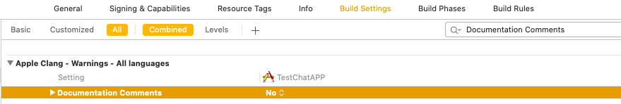
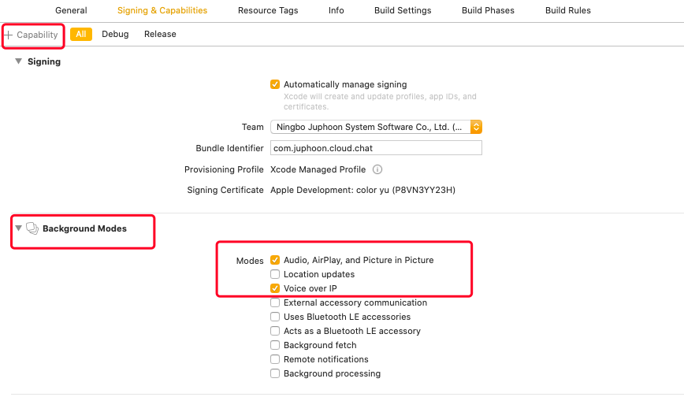

参考文件
======================

.. _iOS 导入动态库:

iOS 导入动态库
---------------------

在 Mac 环境下解压下载的压缩包，解压后的文件夹内有 JCSDK 文件夹。JCSDK 文件夹里包含了 JCSDKOC.framework 和 JCCloudWrapper.framework。

**拷贝文件**

将 JC SDK 文件夹拷贝到您工程所在的目录下，如下图（仅供参考）：

.. image:: images/imshareLib.png

**工程设置**

1. 导入文件和库

点击 ‘General’，在 “Embedded Binaries” 一栏，点击 ‘+’ 符号，然后导入 JCSDK 文件夹下的 JCSDKOC.framework 和 JCCloudWrapper.framework

点击 ‘General’，点击 ‘+’ 符号，在 “Linked Frameworks and Libraries” 一栏，导入 SDK 依赖的其他库，如下图：

2. 设置 Framework Search Paths 路径

点击 ‘Build Settings’，找到 Framework Search Paths 和 Header Search Paths，在右侧输入路径。如下图：

.. image:: images/searchpath_dly.png

.. note:: 在设置 Framework Search Paths 时，一般在完成第1步导入 JCSDKOC.framework 和 JCCloudWrapper.framework 后，Xcode 会自动生成该路径
       如果 Xcode 没有自动生成路径，用户要根据 JCSDKOC.framework 、JCCloudWrapper.framework 和头文件所在目录，手动设置路径。

3. 设置 Enable Bitcode 为 NO

点击 ‘Build Settings’，找到 Enable Bitcode 设置为 NO，如下图：

.. image:: images/bitcodeset.png

4. 设置预处理宏定义

点击 ‘Build Settings’，找到 Preprocessor Macros，在右侧输入 ZPLATFORM=ZPLATFORM_IOS，如下图：

.. image:: images/preprocessorset.png

5. 设置 Documentation Comments 为 NO

点击 ‘Build Settings’，找到 Documentation Comments 设置为 NO，如下图：

6. 设置后台运行模式

点击 ‘Capabilities’，找到 Background Modes，勾选红框内的 Audio, AirPlay, and Picture in Picture，如下图：

**权限设置**

7. 设置麦克风和摄像头的权限

点击 ‘Info’，然后添加麦克风和摄像头权限，如下图：

.. image:: images/permission.png

8. 编译运行

以上步骤进行完后，编译工程，如果没有报错，恭喜您，您已经成功配置 SDK，可以进行下一步了。