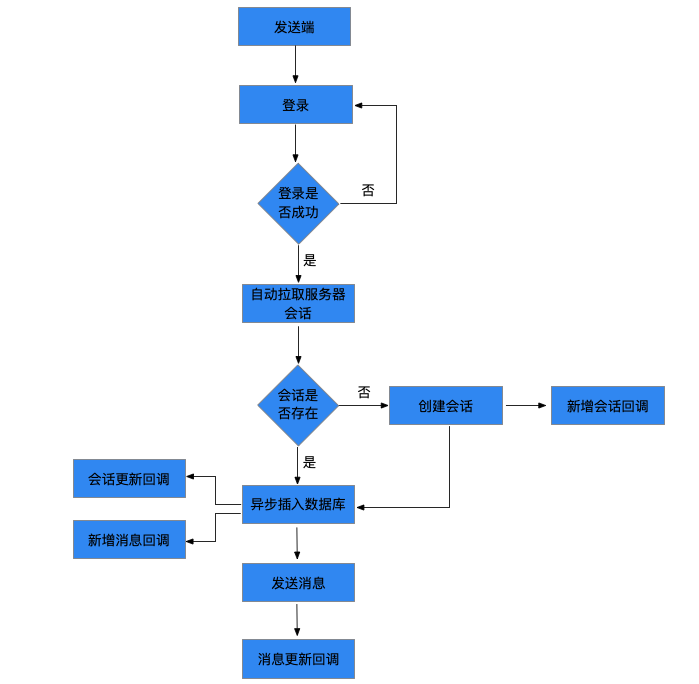
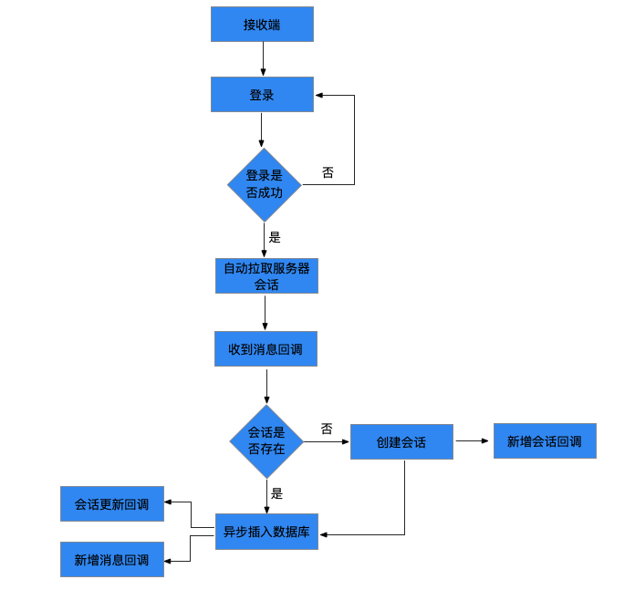
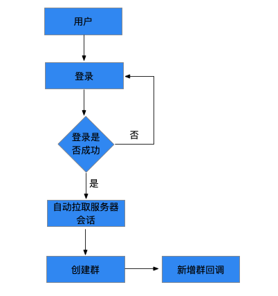

业务流程说明
===================

IM 消息主要为用户提供消息的收发与管理。包括创建会话、发送消息、接收消息、创建群组和群组管理。下面介绍主要的业务流。

发送消息业务流程
---------------------------

发送消息业务流程如下图所示：

用户登录成功后会自动拉取服务器会话列表；

拉取到会话列表之后，需要先判断会话是否存在，如果不存在会去创建会话，并通过 onConversationAdd 回调给上层

发送消息时，需要根据会话是否存在决定是否走创建会话的流程，然后将消息插入到数据库，之后通过 messageChannel 发送消息。

将消息插入到数据库会收到会话更新回调和新增消息回调。

发送消息时会收到消息更新的回调。

接收消息业务流程
---------------------------

接收消息业务流程如下图所示：

用户登录成功后会自动拉取服务器会话列表；

拉取到会话列表之后，需要先判断会话是否存在，如果不存在会去创建会话，并通过 onConversationAdd 回调给上层；

当收到消息时，JC SDK 会先回调给 JCCloudWrapper，JCCloudWrapper 会根据会话是否存在决定是否走创建会话的流程，然后将消息插入到数据库，之后回调给上层。

创建会话会收到会话新增的回调；

将消息插入到数据库会收到会话更新回调和新增消息回调。

创建群组业务流程
---------------------------

创建群组业务流程如下图所示：

用户登录成功后会自动拉取服务器会话列表；

拉取到会话列表之后，需要先判断会话是否存在，如果不存在会去创建会话，并通过 onConversationAdd 回调给上层；

用户通过调用接口创建群组，创建群组会收到新增群组的回调。
